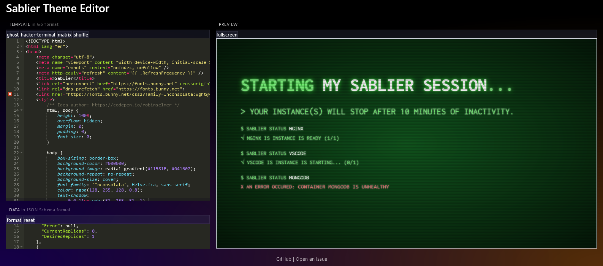

# Sablier Theme Editor

Edit and preview themes directly in the browser!

[Start editing at https://editor.sablierapp.dev/ !](https://editor.sablierapp.dev/)

## Why ?

Sablier themes are Golang [html/templates](https://pkg.go.dev/html/template) because data is fed at access time.

This website allows you to live edit and preview Golang [html/templates](https://pkg.go.dev/html/template) with data.

## Features

- Rich editor (See [Ace (Ajax.org Cloud9 Editor)](https://github.com/ajaxorg/ace)
- Theme input data window with [JSON Schema](./webui/theme.schema.json)
- Golang html/template preview in the browser (With WebAssembly)
- Load default themes from [Sablier](https://acouvreur.github.io/sablier/#/main/themes)
- Editor content is saved to local storage

## Development

Run `make all` and then `npx serve ./webui`.

Everytime you change the wasm file, you need to rebuild with `make all`.

## Credits

This website was inspired by:
- https://gotemplate.io/
- https://ataylor.io/blog/go-templates/